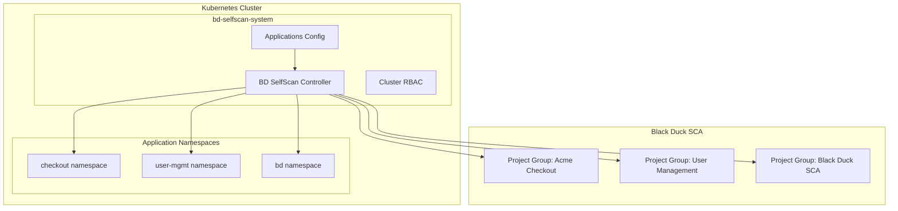

# BD SelfScan - Kubernetes Container Scanning with Black Duck

[](LICENSE)
[](https://kubernetes.io/)
[](https://www.blackduck.com/)
[](https://helm.sh/)

A comprehensive Kubernetes-native solution for automated container vulnerability scanning using Black Duck SCA. BD SelfScan enables multi-application scanning across 50+ applications with both on-demand and automated deployment-triggered scanning capabilities.

## 🚀 Quick Start

```bash
# 1. Create Black Duck credentials secret
kubectl create namespace bd-selfscan-system
kubectl create secret generic blackduck-creds \
  --namespace bd-selfscan-system \
  --from-literal=url="https://your-blackduck-instance.com" \
  --from-literal=token="your-api-token"

# 2. Deploy BD SelfScan
helm install bd-selfscan ./bd-selfscan

# 3. Scan a specific application
helm install bd-scan ./bd-selfscan \
  --set scanTarget="Black Duck SCA"

# 4. Scan all configured applications
helm install bd-scan-all ./bd-selfscan
```

## 📋 Overview

BD SelfScan solves the challenge of vulnerability scanning containers at scale in Kubernetes environments. It provides:

- **Multi-Application Support**: Scan 50+ applications across different namespaces
- **Automated Organization**: Maps Kubernetes apps to Black Duck Project Groups automatically  
- **Two-Phase Approach**: On-demand validation + automated deployment scanning
- **Layer-by-Layer Analysis**: Uses BDSC Container scanning for precise vulnerability detection
- **Kubernetes-Native**: Fully integrated with K8s RBAC, labels, and deployment lifecycles

### Architecture Overview



## 🎯 Key Features

### Phase 1: On-Demand Scanning ✅
- **Single Application Scanning**: Target specific apps by name
- **Bulk Scanning**: Scan all configured applications at once
- **Configuration-Driven**: YAML-based application mapping
- **Project Group Management**: Automatic creation and organization
- **Flexible Label Selectors**: Support for complex Kubernetes label queries

### Phase 2: Automated Scanning ✅
- **Event-Driven Scanning**: Automatic scans on deployments/updates
- **Scheduled Scanning**: Cron-based regular vulnerability scans
- **Monitoring & Alerting**: Prometheus metrics with Grafana dashboards
- **Controller Health**: Self-healing with health checks and restarts
- **Parallel Execution**: Configurable concurrent scan limits

## 📁 Project Structure

```
bd-selfscan/
├── Chart.yaml                           # Helm chart metadata
├── values.yaml                          # Default configuration values
├── README.md                           # This file
├── configs/
│   ├── applications.yaml              # Application configuration
│   └── README.md                       # Configuration guide
├── templates/
│   ├── _helpers.tpl                    # Helm template helpers
│   ├── namespace.yaml                  # System namespace
│   ├── rbac.yaml                       # Cluster RBAC resources
│   ├── configmap-apps.yaml            # Applications ConfigMap
│   ├── configmap-scanner-script.yaml  # Scanner scripts
│   ├── job-on-demand.yaml             # On-demand scan jobs
│   ├── deployment-controller.yaml     # Phase 2 controller
│   ├── servicemonitor.yaml            # Prometheus monitoring
│   └── cronjob-scheduled.yaml         # Scheduled scans
├── scripts/
│   ├── scan-application.sh            # Single application scanner
│   ├── scan-all-applications.sh       # Bulk application scanner  
│   ├── bdsc-container-scan.sh         # Core BDSC scanning logic
│   ├── controller.py                  # Phase 2 Kubernetes controller
│   └── README.md                       # Scripts documentation
└── docs/
    ├── INSTALL.md                      # Detailed installation guide
    ├── CONFIGURATION.md               # Configuration reference
    ├── TROUBLESHOOTING.md             # Common issues and solutions
    └── API.md                         # API reference
```

## ⚡ Quick Examples

### Scan Your Test Case (BD SCA)
```bash
# Scan Black Duck SCA deployment in 'bd' namespace with label 'app=blackduck'
helm install bd-scan-test ./bd-selfscan \
  --set scanTarget="Black Duck SCA"
```

### Scan All Applications  
```bash
# Scan all applications defined in configs/applications.yaml
helm install bd-scan-all ./bd-selfscan
```

### Enable Automated Scanning (Phase 2)
```bash
# Enable automatic scanning on deployments
helm upgrade bd-selfscan ./bd-selfscan \
  --set automated.enabled=true
```

### Debug Mode
```bash
# Enable debug logging and keep temp files
helm install bd-scan-debug ./bd-selfscan \
  --set debug.enabled=true \
  --set debug.logLevel=DEBUG \
  --set debug.keepTempFiles=true \
  --set scanTarget="Black Duck SCA"
```

## 📊 Monitoring

BD SelfScan includes comprehensive monitoring and alerting:

### Metrics
- `bd_selfscan_jobs_created_total` - Total scan jobs created
- `bd_selfscan_jobs_failed_total` - Failed scan jobs
- `bd_selfscan_job_duration_seconds` - Scan job duration histogram
- `bd_selfscan_policy_violations_total` - Policy violations found
- `bd_selfscan_controller_healthy` - Controller health status

### Dashboards
- Scan success/failure rates by application
- Average scan duration trends  
- Policy violation trends by severity
- Controller health and resource usage

### Alerting
- Scan job failures
- Slow scan performance (>30 minutes)
- Controller downtime
- High policy violation rates

## 🔧 Configuration

### Application Configuration Schema
```yaml
applications:
  - name: "Application Name"           # Human-readable name
    namespace: "k8s-namespace"         # Kubernetes namespace  
    labelSelector: "app=example"       # Pod label selector
    projectGroup: "Project Group"      # Black Duck Project Group
    projectTier: 2                     # Priority tier (1-4)
    scanOnDeploy: true                # Enable auto-scan (Phase 2)
    scanSchedule: "0 2 * * 0"         # Cron schedule (Phase 2)
```

### Project Tiers
- **Tier 1 (Critical)**: Financial systems, security components - strictest policies
- **Tier 2 (High)**: Customer-facing applications - strict policies  
- **Tier 3 (Medium)**: Standard applications - standard policies (default)
- **Tier 4 (Low)**: Internal tools, dev environments - relaxed policies

### Common Label Selectors
```yaml
# Standard Kubernetes labels
labelSelector: "app.kubernetes.io/part-of=checkout"

# Multiple labels (AND condition)  
labelSelector: "app=cart,version=v1.2.0"

# Team-based labeling
labelSelector: "team=backend,environment=production"
```

## 🛠️ Installation

### Prerequisites
- Kubernetes 1.25+ cluster
- Helm 3.x
- Black Duck SCA instance with API access
- Cluster-admin or sufficient RBAC permissions

### Detailed Installation
See [docs/INSTALL.md](docs/INSTALL.md) for comprehensive installation instructions.

### Configuration Guide  
See [docs/CONFIGURATION.md](docs/CONFIGURATION.md) for detailed configuration options.

## 🐛 Troubleshooting

### Common Issues

**No images found to scan**
```bash
# Verify namespace and labels
kubectl get pods -n your-namespace -l your-label-selector --show-labels
```

**Black Duck connection errors**
```bash
# Check credentials secret
kubectl get secret blackduck-creds -n bd-selfscan-system -o yaml
```

**Permission errors**
```bash  
# Verify cluster RBAC
kubectl get clusterrole bd-selfscan
kubectl get clusterrolebinding bd-selfscan
```

For comprehensive troubleshooting, see [docs/TROUBLESHOOTING.md](docs/TROUBLESHOOTING.md).

## 📚 Documentation

- **[Installation Guide](docs/INSTALL.md)** - Step-by-step deployment instructions
- **[Configuration Reference](docs/CONFIGURATION.md)** - Comprehensive configuration options  
- **[Troubleshooting Guide](docs/TROUBLESHOOTING.md)** - Common issues and solutions
- **[API Reference](docs/API.md)** - Controller API and webhook specifications
- **[Scripts Documentation](scripts/README.md)** - Scanner script details
- **[Configuration Guide](configs/README.md)** - Application configuration examples

## 🤝 Contributing

1. Fork the repository
2. Create a feature branch (`git checkout -b feature/amazing-feature`)
3. Commit your changes (`git commit -m 'Add amazing feature'`)
4. Push to the branch (`git push origin feature/amazing-feature`)
5. Open a Pull Request

### Development Setup
```bash
# Clone repository
git clone https://github.com/your-org/bd-selfscan.git
cd bd-selfscan

# Install development dependencies
pip install -r scripts/requirements-dev.txt

# Run tests
./scripts/run-tests.sh
```

## 📋 Roadmap

### Phase 1 ✅ (Complete)
- [x] On-demand multi-application scanning
- [x] Configuration-driven application mapping  
- [x] BDSC Container scanning integration
- [x] Automatic Project Group creation
- [x] Cluster-wide RBAC and security

### Phase 2 ✅ (Complete) 
- [x] Kubernetes controller for deployment events
- [x] Automated scan triggering  
- [x] Scheduled scanning with cron
- [x] Prometheus metrics and alerting
- [x] Health checks and self-healing

### Future Enhancements
- [ ] Policy customization per application
- [ ] Slack/Teams notification integration
- [ ] Custom Grafana dashboard templates
- [ ] Multi-cluster federation support
- [ ] GitOps integration (ArgoCD/Flux)

## 📄 License

This project is licensed under the MIT License - see the [LICENSE](LICENSE) file for details.

## 🙋 Support

- **Issues**: [GitHub Issues](https://github.com/your-org/bd-selfscan/issues)
- **Discussions**: [GitHub Discussions](https://github.com/your-org/bd-selfscan/discussions)
- **Documentation**: [Project Wiki](https://github.com/your-org/bd-selfscan/wiki)
- **Security**: For security issues, email security@your-org.com

## 🏆 Acknowledgments

- **Synopsys Black Duck** - Container scanning technology
- **Kubernetes Community** - Container orchestration platform  
- **Helm Community** - Package management for Kubernetes
- **Prometheus Community** - Monitoring and alerting toolkit

---

**Made with ❤️ for secure container deployments**