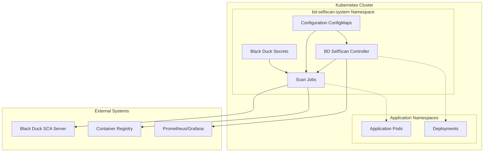
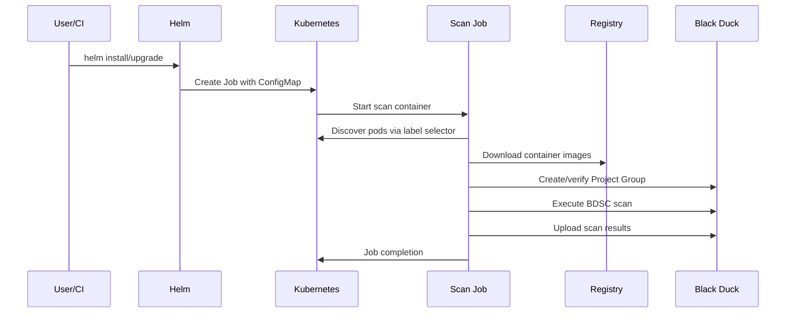
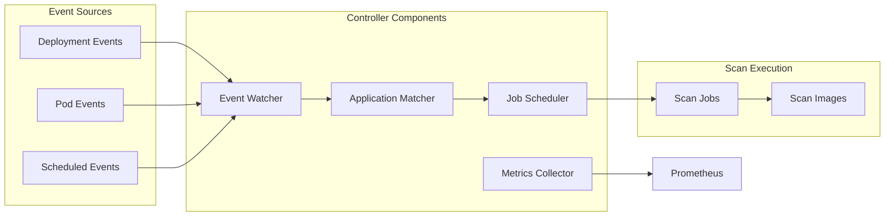
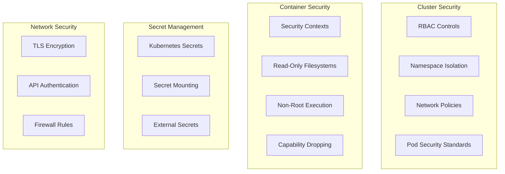
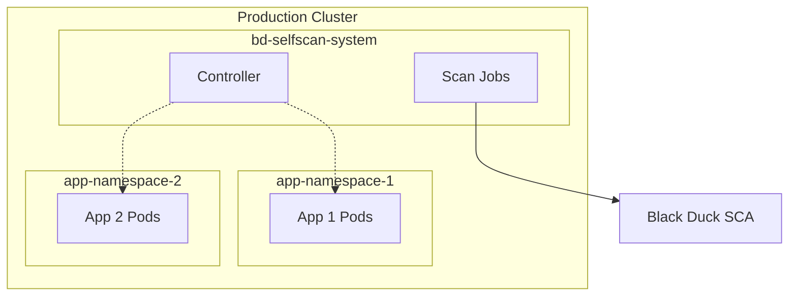
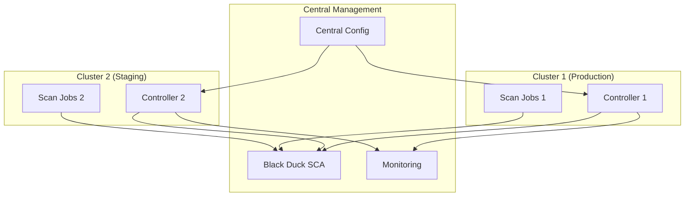

# BD SelfScan Architecture

This document describes the system architecture, design decisions, and technical implementation of BD SelfScan for Kubernetes.

## 📋 Table of Contents

- [System Overview](#system-overview)
- [Architecture Components](#architecture-components)
- [Phase 1: On-Demand Scanning](#phase-1-on-demand-scanning)
- [Phase 2: Automated Scanning](#phase-2-automated-scanning)
- [Data Flow](#data-flow)
- [Security Architecture](#security-architecture)
- [Deployment Architecture](#deployment-architecture)
- [Integration Architecture](#integration-architecture)

## System Overview

BD SelfScan is a Kubernetes-native container vulnerability scanning solution that integrates with Black Duck SCA to provide comprehensive security analysis of containerized applications.

### Design Principles

1. **Kubernetes-Native**: Uses Kubernetes primitives and patterns
2. **Configuration-Driven**: Declarative YAML-based configuration
3. **Microservices-Friendly**: Project organization aligned with microservices architecture
4. **Scalable**: Designed for high-volume, multi-tenant environments
5. **Secure**: Minimal privileges and defense-in-depth security
6. **Observable**: Comprehensive logging, metrics, and monitoring

### Key Capabilities

- **Multi-Application Scanning**: Scan multiple applications simultaneously
- **Container Layer Analysis**: BDSC-based layer-by-layer vulnerability detection
- **Project Group Management**: Automatic Black Duck project organization
- **Event-Driven Automation**: Automatic scanning on deployment events
- **Policy Integration**: Vulnerability policy enforcement and reporting

## Architecture Components



### Core Components

#### 1. BD SelfScan Controller (Phase 2)
- **Type**: Kubernetes Deployment
- **Language**: Python 3.9+
- **Purpose**: Event processing, scan orchestration, monitoring
- **Resources**: 256Mi-1Gi memory, 100m-500m CPU

#### 2. Scan Jobs (Phase 1 & 2)
- **Type**: Kubernetes Jobs
- **Language**: Shell scripts + Java (Synopsys Detect)
- **Purpose**: Container image scanning and vulnerability analysis
- **Resources**: 4-16Gi memory, 1-8 CPU cores, 20-100Gi ephemeral storage

#### 3. Configuration Management
- **Type**: ConfigMaps and Secrets
- **Purpose**: Application mapping, scanner configuration, credentials
- **Components**: `applications.yaml`, Black Duck credentials, scanner settings

## Phase 1: On-Demand Scanning

### Architecture Overview



### Key Components

#### Scan Job Container
```dockerfile
FROM ubuntu:22.04
# Pre-installed tools:
# - Java 17 (Synopsys Detect runtime)
# - kubectl (Kubernetes API access)
# - skopeo (Container image operations)
# - yq/jq (YAML/JSON processing)
# - Black Duck Signature Scanner for Containers (BDSC)
```

#### Configuration Schema
```yaml
applications:
  - name: "Application Name"
    namespace: "k8s-namespace"
    labelSelector: "app=example"
    projectGroup: "Black Duck Project Group"
    projectTier: 2  # 1=Critical, 2=High, 3=Medium, 4=Low
    description: "Application description"
```

#### Scanning Process
1. **Discovery**: Find pods using label selectors
2. **Image Extraction**: Extract container image references
3. **Image Download**: Download images using Skopeo
4. **Project Setup**: Create/verify Black Duck Project Groups
5. **BDSC Scanning**: Layer-by-layer vulnerability analysis
6. **Result Upload**: Upload scan results to Black Duck
7. **Cleanup**: Remove temporary files and containers

## Phase 2: Automated Scanning

### Architecture Overview



### Controller Architecture

#### Event Processing Pipeline
```python
async def process_deployment_event(event):
    # 1. Event validation and filtering
    if not self.is_valid_event(event):
        return
    
    # 2. Application configuration matching
    app_config = self.match_application(event)
    if not app_config or not app_config.scan_on_deploy:
        return
    
    # 3. Scan job creation
    job_spec = self.create_scan_job(event, app_config)
    await self.kubernetes_api.create_job(job_spec)
    
    # 4. Metrics and logging
    self.metrics.increment_job_created()
    self.logger.info(f"Scan job created for {app_config.name}")
```

#### Key Features
- **Async Event Processing**: High-throughput event handling
- **Configuration Hot-Reload**: Live configuration updates
- **Health Monitoring**: Kubernetes health and readiness probes
- **Metrics Collection**: Prometheus metrics exposition
- **Resource Management**: Automatic cleanup and resource optimization

### Scheduled Scanning (Planned)
```yaml
applications:
  - name: "Example App"
    # ... other config ...
    scanSchedule: "0 2 * * 0"  # Weekly Sunday at 2 AM
    scanOnDeploy: true
```

## Data Flow

### Phase 1 Data Flow
```
User/CI → Helm → Kubernetes Job → Container Discovery → 
Image Download → BDSC Scan → Black Duck Project Creation → 
Vulnerability Analysis → Results Storage
```

### Phase 2 Data Flow
```
Kubernetes Events → Controller Event Watcher → 
Application Configuration Matching → Job Creation → 
Phase 1 Scanning Process → Metrics Collection → 
Monitoring and Alerting
```

### Black Duck Project Organization
```
Project Group: "Acme Checkout"
├── Project: cart-service
│   ├── Version: 2025.08.1 (latest container scan)
│   └── Version: 2025.08.2 (previous container scan)
├── Project: pricing-service
│   ├── Version: 1.19.0
│   └── Version: 1.19.1
└── Project: gateway-service
    ├── Version: v87
    └── Version: v88
```

## Security Architecture

### Security Boundaries



### RBAC Design

#### Controller RBAC
```yaml
rules:
  # Watch deployment events
  - apiGroups: ["apps"]
    resources: ["deployments"]
    verbs: ["get", "list", "watch"]
  
  # Manage scan jobs
  - apiGroups: ["batch"]
    resources: ["jobs"]
    verbs: ["create", "get", "list", "delete"]
  
  # Read pods for container discovery
  - apiGroups: [""]
    resources: ["pods"]
    verbs: ["get", "list"]
```

#### Scanner RBAC
```yaml
rules:
  # Cross-namespace pod discovery
  - apiGroups: [""]
    resources: ["pods"]
    verbs: ["get", "list"]
  
  # Configuration access
  - apiGroups: [""]
    resources: ["configmaps"]
    verbs: ["get"]
```

### Container Security

#### Security Contexts
```yaml
# Controller security context
securityContext:
  runAsNonRoot: true
  runAsUser: 65534
  runAsGroup: 65534
  fsGroup: 65534
  readOnlyRootFilesystem: true

# Scanner security context (requires privileges for container operations)
securityContext:
  allowPrivilegeEscalation: true  # Required for container scanning
  runAsUser: 0  # Required for image operations
  capabilities:
    add: ["SYS_ADMIN"]  # Required for container mounting
```

## Deployment Architecture

### Single-Cluster Deployment


### Multi-Cluster Deployment (Future)


## Integration Architecture

### Black Duck SCA Integration

#### API Integration
```python
# Black Duck API client
class BlackDuckClient:
    def __init__(self, url, token):
        self.base_url = url
        self.auth_header = f"Bearer {token}"
    
    async def create_project_group(self, name):
        # Create project group if not exists
        pass
    
    async def trigger_scan(self, project, version, scan_path):
        # Trigger BDSC scan via Synopsys Detect
        pass
    
    async def get_scan_results(self, project, version):
        # Retrieve scan results and vulnerabilities
        pass
```

#### Project Management
- **Project Groups**: Application-level organization
- **Projects**: Microservice-level tracking  
- **Versions**: Container image tag-based versioning
- **Policies**: Tier-based vulnerability policies

### Container Registry Integration

#### Supported Registries
- Docker Hub
- GitHub Container Registry (GHCR)
- AWS Elastic Container Registry (ECR)
- Azure Container Registry (ACR)
- Google Container Registry (GCR)
- Harbor
- Private registries with authentication

#### Image Handling
```bash
# Skopeo-based image operations
skopeo copy docker://registry.com/image:tag dir:/tmp/image-scan
skopeo inspect docker://registry.com/image:tag
```

### Monitoring Integration

#### Prometheus Metrics
```python
# Controller metrics
BD_SELFSCAN_DEPLOYMENT_EVENTS = Counter(
    'bd_selfscan_deployment_events_total',
    'Total deployment events processed',
    ['namespace', 'application']
)

BD_SELFSCAN_JOBS_CREATED = Counter(
    'bd_selfscan_jobs_created_total',
    'Total scan jobs created',
    ['application', 'tier']
)

BD_SELFSCAN_JOB_DURATION = Histogram(
    'bd_selfscan_job_duration_seconds',
    'Scan job duration in seconds',
    ['application', 'status']
)
```

#### Health Endpoints
- **`/health`**: Overall system health
- **`/ready`**: Readiness for traffic
- **`/metrics`**: Prometheus metrics

## Performance Considerations

### Scalability Factors
- **Concurrent Scans**: Limited by cluster resources and Black Duck API rate limits
- **Image Size**: Large container images require more storage and processing time
- **Network Bandwidth**: Container image downloads and Black Duck API calls
- **Memory Usage**: BDSC scanning requires substantial memory for large applications

### Resource Planning
```yaml
# Recommended resource allocation
controller:
  requests: { memory: "256Mi", cpu: "100m" }
  limits: { memory: "1Gi", cpu: "500m" }

scanner:
  requests: { memory: "4Gi", cpu: "1", ephemeralStorage: "20Gi" }
  limits: { memory: "16Gi", cpu: "8", ephemeralStorage: "100Gi" }
```

### Performance Optimization
1. **Image Caching**: Container registry proximity and caching
2. **Parallel Processing**: Multi-threaded scanning when possible
3. **Resource Tuning**: CPU and memory optimization per workload
4. **Network Optimization**: Fast container registry access

---

**Last Updated**: January 2025  
**Architecture Version**: 2.0  
**Next Review**: March 2025